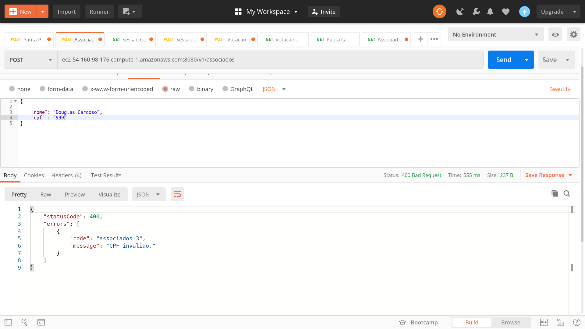

# API REST Gerenciamento de Sessões de Votação


## Cloud Provider

O Cloud Provider escolhido para essa solução foi a `Amazon Web Services (AWS)`. Foram utilizados os serviços:

* IAM
* EC2
* CloudWatch
* CloudSearch
* Simple Queue Service (SQS)
* RDS

## Funcionalidades

### Cadastrar uma Nova Pauta

1. Ao tentar salvar passando um objeto Json vazio no payload de request, é retornado um código Http de erro `400 Bad Request` com um array de mensagens solicitando os atributos obrigatórios.


2. Ao tentar salvar passando um atributo inválido no payload de request, é retornado um código Http de erro `400 Bad Request` com a mensagem `Payload do request invalido`.


3. Ao tentar salvar, passando um payload de request válido, é retornado um código `Http 201 Created` com o payload de response.


### Abrir uma nova Sessão de Votação em uma Pauta

1. Ao criar uma nova sessão de votação em uma pauta, a sessão de votação fica aberta (status `EM_ANDAMENTO`) por um tempo determinado no payload de request ou 1 minuto por default.


### Receber Votos dos Associados em Pautas

1. Enquanto a sessão de votação estiver aberta (status `EM_ANDAMENTO`), é possível receber votos dos associados.


### Contabilizar os Votos e Dar o Resultado da Votação na Pauta

1. Ao finalizar a sessão de votação (status `FINALIZADA`), é possível visualizar o total de votos.


### Hateoas

Foi aplicado Hateoas na API. Assim, para cada Post, no atributo `Location` do `Header` do response, é enviado o endereço de recuperação do recurso recém criado.


## Tarefas Bônus


### Integração com Sistemas Externos


1. Para o caso em que o CPF for inválido, será retornado um erro `400 (Bad Request)` com a mensagem `CPF invalido`.



2. Para o caso o em que o CPF for válido, mas a API externa retornar `UNABLE_TO_VOTE`, será retornado um erro `400 (Bad Request)` com a mensagem `Nao qualificado para votar`.


### Mensageria e filas

Assim que a sessão de votação fecha (status `FINALIZADA`), é postado uma nova mensagem em uma fila `SQS (Amazon Simple Queue Service)`, com o resultado da votação, ou seja, com os seguintes dados:

	* Id da Sessão
	
	* Total de votos Sim
	
	* Total de votos Não


#### Exemplo de Log para o Envio de Mensagem pelo Microsserviço votacao

```
2020-06-01 20:30:39.900  INFO 11223 --- [lTaskScheduler1] c.sicredi.votacao.service.SessaoService  : Notificando fila SQS. Sessao ID: 1511, Total de Votos Sim: 0, Total de Votos Nao: 1
```

Obs.: Aplicação rodando na instância EC2 da Amazon: `ec2-user@ec2-54-160-98-176.compute-1.amazonaws.com`.


#### Exemplo de Log para o Recebimento de Mensagem pelo Microsserviço votacao-discovery-indexer

```
020-06-01 20:30:39.979  INFO 10489 --- [pool-1-thread-1] c.sicredi.votacao.discovery.Application  : Mensagem: {"sessao_id":1511,"total_votos_sim":0,"total_votos_nao":1}
2020-06-01 20:30:39.980  INFO 10489 --- [pool-1-thread-1] c.sicredi.votacao.discovery.Application  : Batch: [{"type": "add", "id": "1511", "fields": {"sessao_id":1511,"total_votos_sim":0,"total_votos_nao":1}}]
```
Obs.: Aplicação rodando na instância EC2 da Amazon: `ec2-user@ec2-3-235-132-89.compute-1.amazonaws.com`.


#### Amazon CloudSearch

Os dados de mensagem da fila SQS são enviados para o serviço de pesquisa da Amazon, o [Amazon CloudSearch](https://aws.amazon.com/pt/cloudsearch/), onde é possível montar variadas soluções de pesquisa, conforme demandas do negócio.


### Performance

Para os testes de performance, foi utilizado a ferramenta [Locust](https://locust.io/), junto com o serviço de métricas [CloudWatch da Amazon](https://aws.amazon.com/pt/cloudwatch/).

Para o `Locust`, foi configurado um total de 100.000 usuários para simulação e um `Hatch Rate` (i.e., para cada segundo, quantos usuários serão adicionados aos usuários atuais até a quantidade total de usuários) de 100 usuários.  


Ao clicar no botão `Start swarming`, é possível verificar os seguintes gráficos na aba `Charts`:

	* Total de Requests por Segundo
	
	* Tempos de Respota (ms)
	
	* Número de Usuários


#### Amazon CloudWatch

No Amazon CloudWatch, foram criadas as seguintes métricas para a `Porcentagem de Latência` e o `Número Total de Requests`:

	* SalvarSessao-Latencia
	
	* SalvarSessao-Requests
	
	* BuscarSessao-Requests
	
	* BuscarSessao-Latencia


### Versionamento da API

A estratégia utilizada para o versionamento da API foi versionar pelo `path da URI`, ou seja, incluir o número da versão ao `path na URI`.


### Arquitetura do Projeto


A API segue um padrão de arquitetura `MVC (Model-View-Controller)`.

Na camada `Model`, estão as classes do pacote `.model` e `.repository` para integração com a camada de persistência.

Na camada `View`, estão as classes do pacote `.resource` para integração com a camada web através da definição dos endpoints.

Na camada `Controller`, estão as classes do pacote `.service` para integração com a camada de serviços/negócios.


### Persistência

É utilizado o banco de dados relacional [MySQL](https://www.mysql.com/) para a persistência dos dados da aplicação.


### Tratamento de Erros e Exceções

O tratamento de erros e exceções foi desenvolvido conforme artigo publicado por `Ali Dehghani` em [RESTful API Design: How to handle errors?](https://alidg.me/blog/2016/9/24/rest-api-error-handling).


### Uso de Testes Automatizados e Ferramentas de Qualidade

* Para os testes automatizados, foram implementadas classes de testes unitários para a camada web (ou seja, classes no pacote `.resource`) e de serviços/negócios (ou seja, classes no pacote `.service`). Também foram implementadas classes para os testes de integração, passando por todas as camadas da API (web, serviços/negócios, persistência).

* Com relação a ferramentas de qualidade, foi utilizado o plugin [sonarlint](https://www.sonarlint.org/eclipse/) do Eclipse. 


### Documentação do Código e da API

* Para a documentação do código-fonte, foi utilizado Javadoc no cabeçalho dos métodos e das classes.

* Para a documentação da API, foi utilizado a ferramenta [Swagger](https://swagger.io/).


